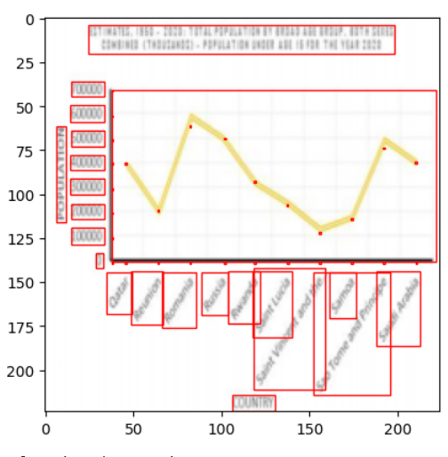
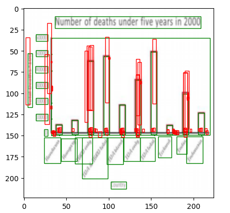
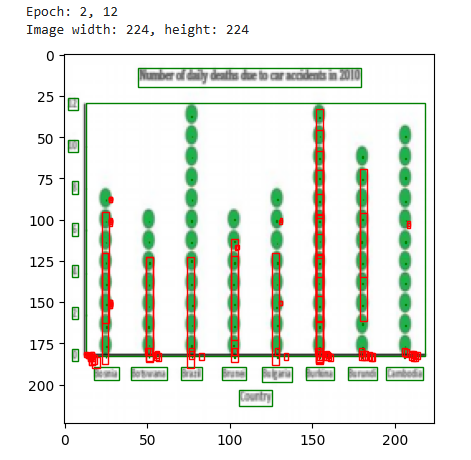

# ChartCV

**Sample of image and elements plotted**

**Sample of image, prediction and target plotted**
Key running hyperparameters:
  * learning rate = 0.005
  * batch size = 8
  * weight decay = 0.0005
  * epoch run = 1

**Future work**
  * extend more epoch run with scheduler for learning rate and other hyperparameters
