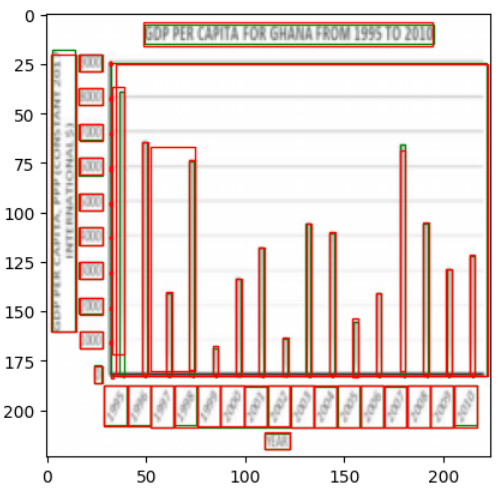
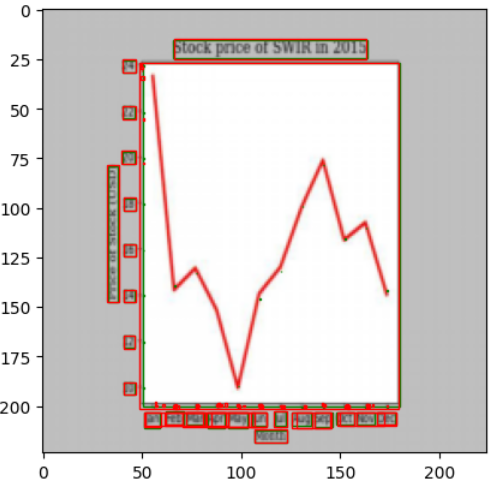

# ChartCV

**Project Purpose**

ChartCV is a project aimed at automatically extracting data points from various chart types, including bar charts and scatter plots, using computer vision techniques.

**Model Architecture**

The model utilizes a convolutional neural network (CNN) architecture based on Resnet50fpn to detect and localize chart elements.

**Data Size**

The model was trained and tested on a dataset of 60k images, consisting of both synthetic and real-world charts. 

**Sample of image and elements plotted**

**Sample of image, prediction and target plotted**

Key running hyperparameters include a learning rate of 0.005, a batch size of 8, weight decay of 0.0005, and 1 epoch of training.
    

**Future work**

Future work will focus on extending the training with more epochs and implementing a learning rate scheduler and hyperparameter tuning. Additionally, we aim to expand the model's capabilities to handle more complex chart types and improve overall accuracy.
